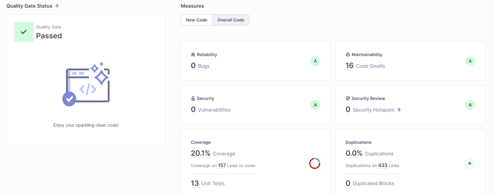
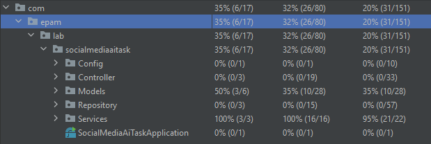
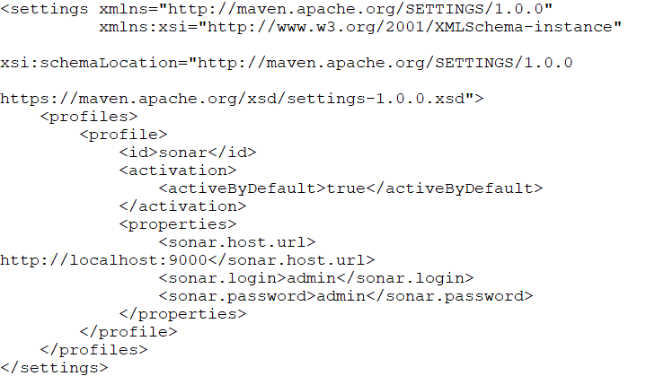

# My Spring Boot Application

## Task

Build a RESTful API for a simple social media application using Spring Boot, Hibernate, and PostgreSQL.
The application should allow users to create and view posts, follow other users, and like posts.
Each post should have a title, body, and author.
Use Hibernate to persist the post and user data in the database.

## Prerequisites

- JDK 8 or later installed _(JDK 11 or later recommended)_
- Maven 3.6.0 or later installed _(3.9.1 or later recommended)_

## Getting Started

1. Clone this repository:

   ```sh
   git clone https://github.com/Seniuk-Vi/SocialMedia-AI-task
   cd SocialMedia-AI-task
   ```

2. Create empty PostgreSQL database and add credentials to hibernate.cfg.xml

   ```sh
   <!--DB_NAME-->
   <!--USERNAME-->
   <!--PASSWORD-->
   ```   

3. Build and run the project:

   ```sh
   mvn clean clean install
   ```

The application should now be up and running at `http://localhost:8080`.

## Code Quality Analysis with SonarQube

SonarQube is an open-source platform for continuous code quality analysis. It helps developers identify potential
issues like code smell, vulnerabilities, and bugs. In this project, we have integrated SonarQube for code quality
control.




### To run SonarQube analysis in Docker, follow these steps:

1. Run Docker and run sonarqube

   ```
   sudo docker run -d --name sonarqube -p 9000:9000 -v /sonar/data:/opt/sonarqube/data -v /sonar/extensions:/opt/sonarqube/extensions sonarqube:9.3.0-community
   ```

2. You can access the SonarQube web portal at `http://localhost:9000`. The default login credentials are `admin`
   for both the username and password.

3. Create settings.xml in your `User/.m2` folder. Pass your credentials to SonarQube.

   

4. Run the analysis: In the terminal, navigate to your project's root directory and execute the following command:

   ```sh
   mvn clean install sonar:sonar
   ```

5. View the report: After the analysis is complete, you can view the report by going
   to `http://localhost:9000/projects` and clicking on your project.

# Feedback

1. Was it easy to complete the task using AI?
    - Quite easy, but there were some problems with `hibernate`, AI just insisted on using JPA, and it was hard to
      get proper configuration for plain hibernate.
2. How long did task take you to complete? (Please be honest, we need it to gather anonymized statistics)
    - Around 7 hours.
3. Was the code ready to run after generation? What did you have to change to make it usable?
    - For plain java it was perfect. But when using hibernate, chat provided deprecated arguments for configuration.
      Also with when working with SonarQube + Spring Boot, it was hard to configure, on the internet there no a lot of
      helpful articles about it, I need to combine Chat and Internet to get that working.
4. Which challenges did you face during completion of the task?
    - Hibernate and SonarQube (with JaCoCo) configuration.
5. Which specific prompts you learned as a good practice to complete the task?
    - I used Chat to generate phases of building such project, and asked to add questions to each phase, that I can
      ask Chat to help me.

